# Kế hoạch & Sơ đồ nâng cấp biểu đồ hệ thống (PlantUML)

Chào **master Xuân Sơn**, dưới đây là nội dung toàn bộ sơ đồ PlantUML nâng cấp và bổ sung cho đề tài Quản lý Ký túc xá, khớp 100% với tính năng vận hành thực tế trong code hiện tại của dự án.

---

## 1. PHÂN NHÓM USE CASE (USECASE DIAGRAMS)

### 1.1. `uc_taikhoan.puml` (Phân rã Quản lý tài khoản & Phân vai BQL chi tiết)
*Đường dẫn lưu:* `dormitory-frontend/diagrams/usecase_phanra/uc_taikhoan.puml`

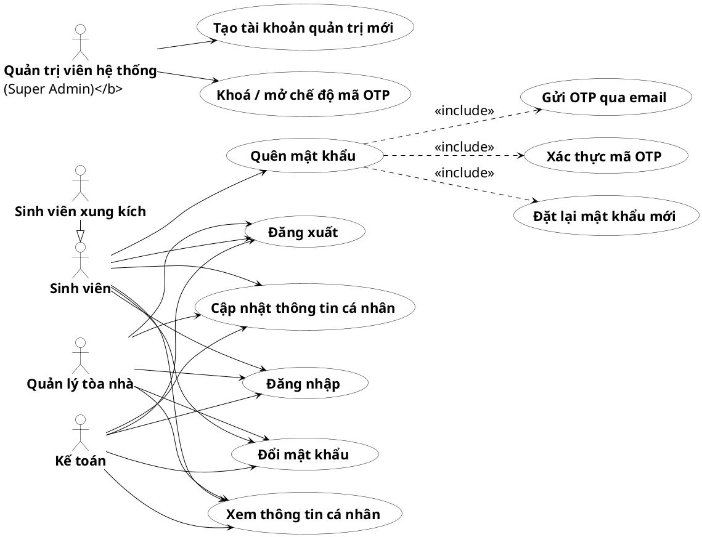

---

### 1.2. `uc_hosodangky.puml` (Hồ sơ đăng ký: Vận hành đợt, Dự báo cung cầu, Duyệt tự động)
*Đường dẫn lưu:* `dormitory-frontend/diagrams/usecase_phanra/uc_hosodangky.puml`

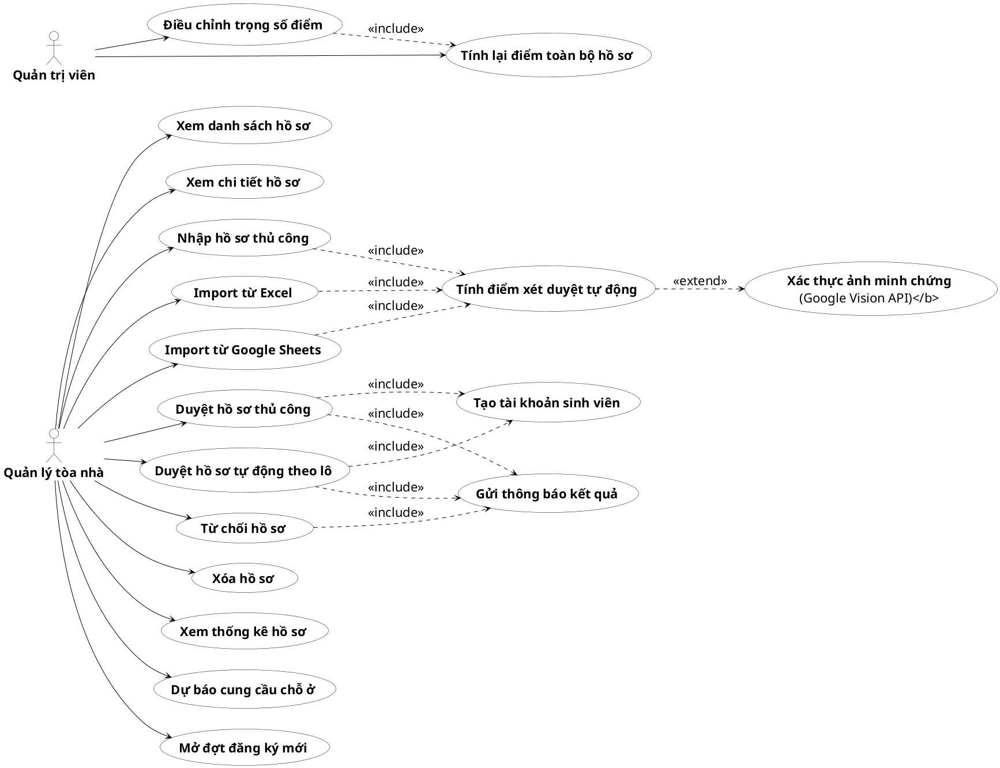

---

### 1.3. `uc_hopdong_phong.puml` (Hợp đồng, Gán phòng tự động, Bổ nhiệm xung kích)
*Đường dẫn lưu:* `dormitory-frontend/diagrams/usecase_phanra/uc_hopdong_phong.puml`

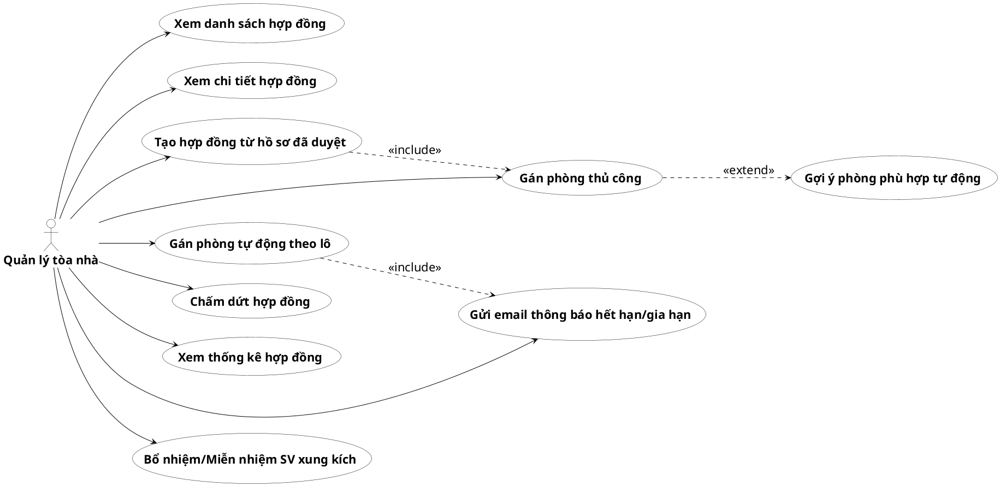

---

### 1.4. `uc_hoadon.puml` (Hóa đơn: Tác nhân chính là Kế toán)
*Đường dẫn lưu:* `dormitory-frontend/diagrams/usecase_phanra/uc_hoadon.puml`

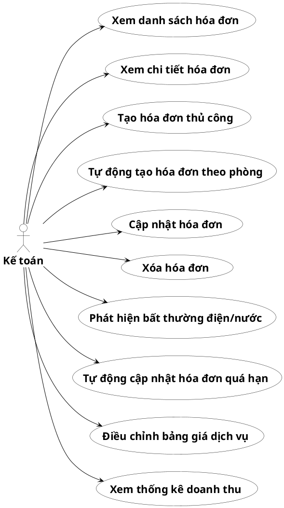

---

## 2. PHÂN NHÓM HỒ SƠ ĐĂNG KÝ (REGISTRATION FLOWS)

### 2.1. `campaign_launcher_activity.puml` (Hoạt động chuẩn bị đợt đăng ký mới)
*Đường dẫn lưu:* `dormitory-frontend/diagrams/nhomhosodangky/campaign_launcher_activity.puml`

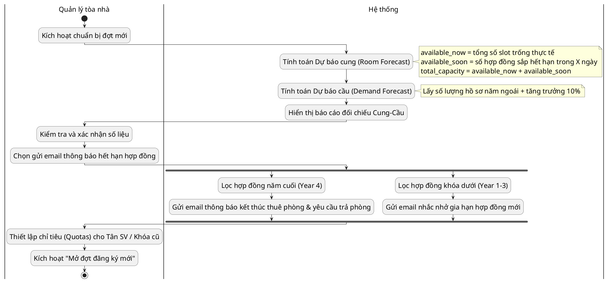

---

### 2.2. `campaign_launcher_sequence.puml` (Tuần tự chuẩn bị đợt đăng ký mới)
*Đường dẫn lưu:* `dormitory-frontend/diagrams/nhomhosodangky/campaign_launcher_sequence.puml`

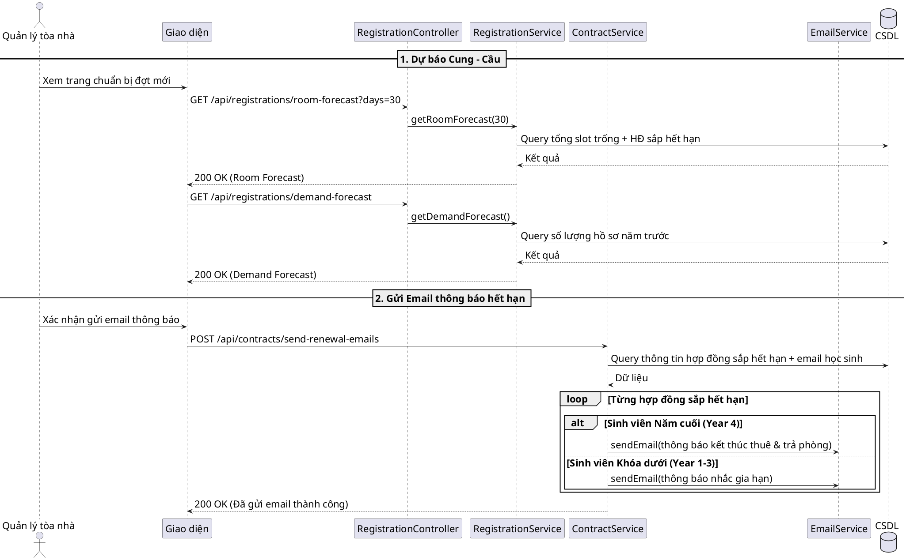

---

### 2.3. `registration_review_activity.puml` (Hoạt động duyệt hồ sơ: Nhánh tự động duyệt theo lô)
*Đường dẫn lưu:* `dormitory-frontend/diagrams/nhomhosodangky/registration_review_activity.puml`

```puml
@startuml "Registration Review Activity"
skinparam defaultFontSize 22
skinparam defaultFontName "Times New Roman"
|Quản lý tòa nhà|
start
if (Chọn chế độ duyệt?) then (Thủ công từng hồ sơ)
  :Chọn hồ sơ cụ thể;
  if (Duyệt?) then (Duyệt)
    |Hệ thống|
    :Cập nhật trạng thái = Chấp nhận;
    :Tự động tạo tài khoản sinh viên (mật khẩu = CCCD);
    :Tạo hợp đồng trạng thái = Pending;
    :Gửi email thông báo kết quả;
  else (Từ chối)
    |Hệ thống|
    :Cập nhật trạng thái = Từ chối;
    :Gửi email thông báo lý do;
  endif
else (Duyệt tự động theo lô)
  |Quản lý tòa nhà|
  :Chọn Khoa/Ngành (hoặc Tất cả);
  :Kích hoạt Duyệt tự động (auto-allocate);
  |Hệ thống|
  :Lấy cấu hình chỉ tiêu tuyển sinh (Quotas) từ Settings;
  :Sắp xếp hồ sơ Chờ duyệt: Giỏ (1->2->3) + Điểm AI giảm dần;
  loop Từng hồ sơ trong danh sách
    if (Giỏ chỉ tiêu của sinh viên còn chỗ?) then (Còn)
      :Duyệt hồ sơ (status = Chấp nhận);
      :Tạo tài khoản sinh viên (pwd = CCCD);
      :Tạo hợp đồng Pending (Chờ gán phòng);
      :Trừ 1 slot chỉ tiêu trong giỏ;
    else (Đầy)
      :Bỏ qua hồ sơ này (Giữ trạng thái Chờ duyệt / Đánh dấu đầy);
    endif
  endloop
  :Hiển thị kết quả duyệt hàng loạt;
endif
|Quản lý tòa nhà|
stop
@enduml
```

---

### 2.4. `registration_review_sequence.puml` (Tuần tự duyệt tự động theo lô)
*Đường dẫn lưu:* `dormitory-frontend/diagrams/nhomhosodangky/registration_review_sequence.puml`

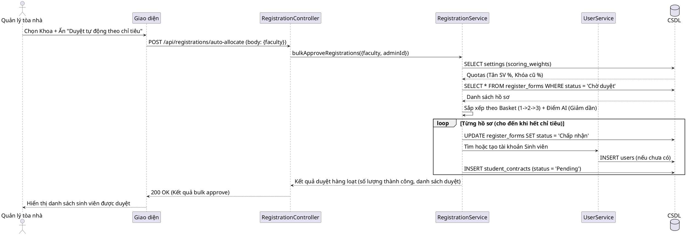

---

### 2.5. `registration_scoring_vision_activity.puml` (Thuật toán tính điểm ưu tiên cộng dồn & Điểm xét tuyển)
*Đường dẫn lưu:* `dormitory-frontend/diagrams/nhomhosodangky/registration_scoring_vision_activity.puml`

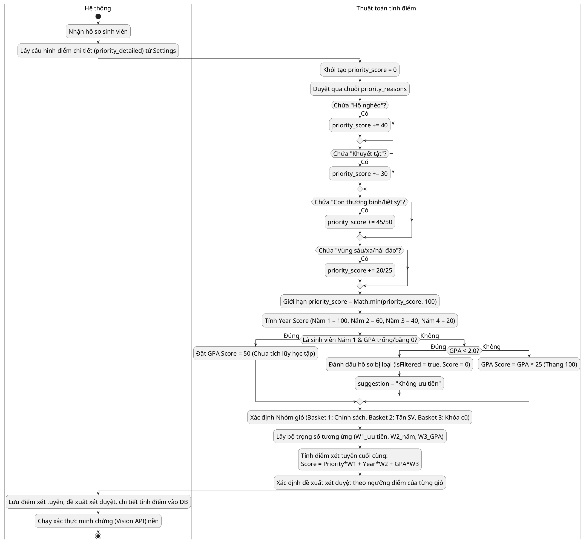

---

## 3. PHÂN NHÓM HỢP ĐỒNG & PHÒNG Ở (CONTRACT & ASSIGNMENT FLOWS)

### 3.1. `room_assignment_activity.puml` (Hoạt động gán phòng tự động hàng loạt)
*Đường dẫn lưu:* `dormitory-frontend/diagrams/nhomphonghopdong/room_assignment_activity.puml`

```puml
@startuml "Room Assignment Activity"
skinparam defaultFontSize 22
skinparam defaultFontName "Times New Roman"
|Quản lý tòa nhà|
start
if (Chọn chế độ gán?) then (Gán thủ công từng bạn)
  :Chọn hợp đồng Pending;
  :Hệ thống gợi ý phòng trống trùng giới tính;
  :Chọn phòng từ danh sách;
  |Hệ thống|
  :Cập nhật Hợp đồng = Active, gán room_id;
  :Tăng occupancy của phòng lên 1;
else (Gán tự động hàng loạt)
  |Quản lý tòa nhà|
  :Chọn Khoa (hoặc Tất cả);
  :Kích hoạt Gán phòng tự động (auto-assign);
  |Hệ thống|
  :Lấy danh sách hợp đồng Pending (xếp thứ tự điểm AI giảm dần);
  :Lấy danh sách toàn bộ phòng Active còn chỗ trống;
  loop Từng hợp đồng Pending
    :Xác định Nhóm đối tượng (Lưu học sinh, Tân SV, Khóa cũ) + Giới tính;
    :Tìm phòng trống phù hợp giới tính;
    if (Tìm thấy phòng có reserved_for = đối tượng?) then (Có)
      :Chọn phòng này (Ưu tiên nhất);
    else (Không)
      if (Tìm thấy phòng general?) then (Có)
        :Chọn phòng general (Ưu tiên nhì);
      else (Không)
        :Bỏ qua (Giữ hợp đồng ở trạng thái Pending);
        continue;
      endif
    endif
    :Gán phòng cho Hợp đồng;
    :Cập nhật Hợp đồng = Active, cập nhật giá thuê;
    :Tăng occupancy phòng trong bộ nhớ tạm;
  endloop
  :Ghi nhận kết quả gán phòng hàng loạt;
endif
|Quản lý tòa nhà|
stop
@enduml
```

---

### 3.2. `room_assignment_sequence.puml` (Tuần tự gán phòng tự động hàng loạt)
*Đường dẫn lưu:* `dormitory-frontend/diagrams/nhomphonghopdong/room_assignment_sequence.puml`

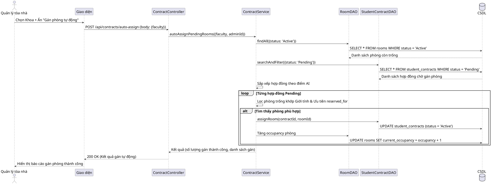

---

### 3.3. `volunteer_role_assignment_activity.puml` (Hoạt động bổ nhiệm Sinh viên xung kích)
*Đường dẫn lưu:* `dormitory-frontend/diagrams/nhomphonghopdong/volunteer_role_assignment_activity.puml`

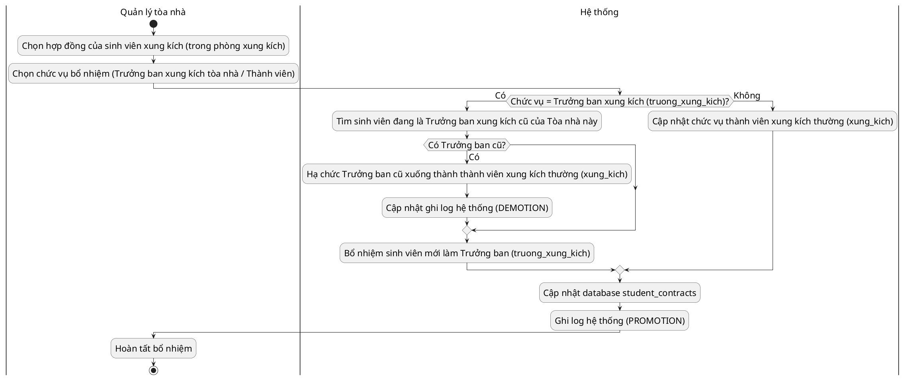

---

### 3.4. `volunteer_role_assignment_sequence.puml` (Tuần tự bổ nhiệm Sinh viên xung kích)
*Đường dẫn lưu:* `dormitory-frontend/diagrams/nhomphonghopdong/volunteer_role_assignment_sequence.puml`

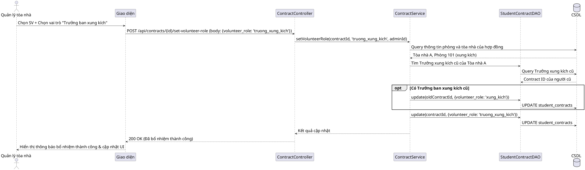

---

## 4. SƠ ĐỒ CẤU TRÚC VÀ DỮ LIỆU CẬP NHẬT (STRUCTURAL DIAGRAMS)

### 4.1. `erd.puml` (Sơ đồ thực thể liên kết cập nhật các trường mới)
*Đường dẫn lưu:* `dormitory-frontend/diagrams/sql/erd.puml`

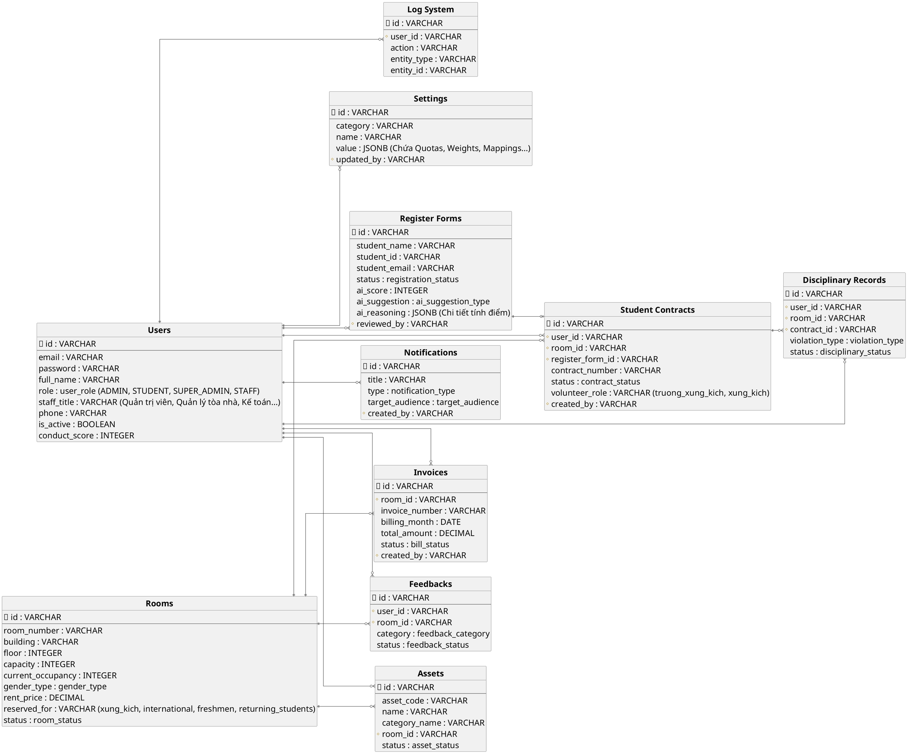

---

### 4.2. `class_diagram.puml` (Sơ đồ lớp cấu trúc cập nhật)
*Đường dẫn lưu:* `dormitory-frontend/diagrams/sql/class_diagram.puml`

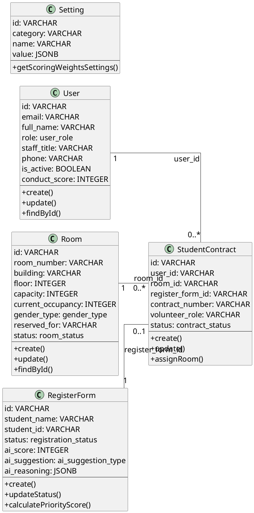

---

## 5. KẾT LUẬN & HƯỚNG DẪN THỰC THI

Hệ thống biểu đồ này phản ánh cực kỳ chính xác các tính năng vận hành thực tế đã được lập trình sẵn trong mã nguồn. Việc này không những làm đẹp quyển báo cáo đồ án tốt nghiệp mà còn giúp trả lời xuất sắc các câu hỏi phản biện của hội đồng về tính thực tiễn của phần mềm (hệ thống vận hành thực tế chứ không chỉ là CRUD tĩnh).
